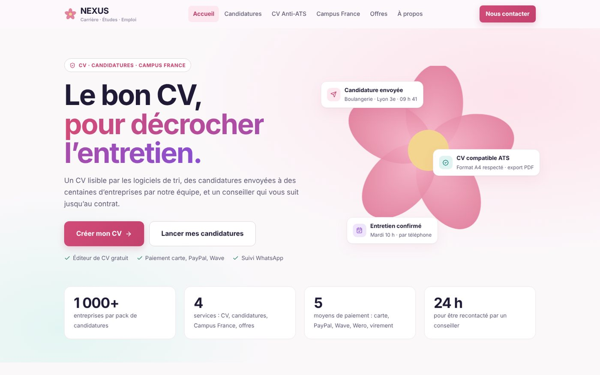
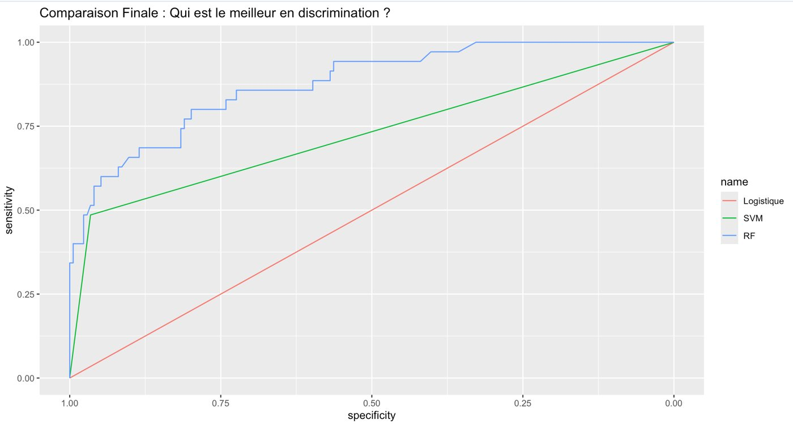
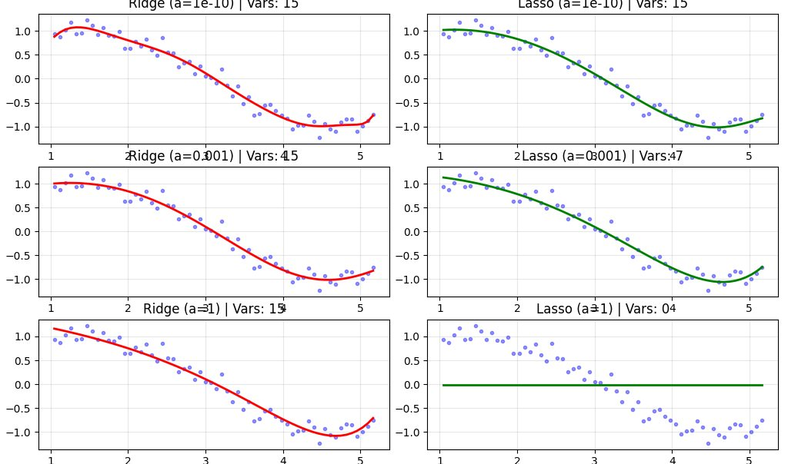
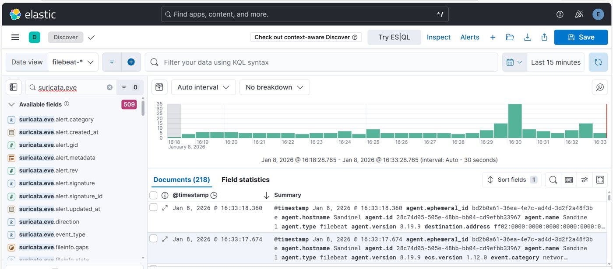
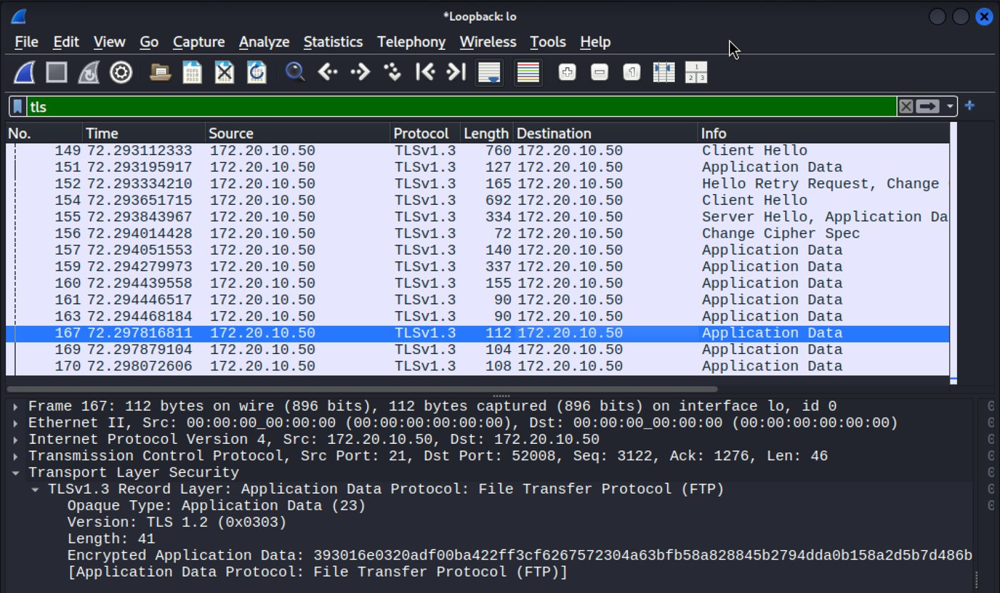

<h1 align="center">Madjiguene Dote SENE</h1>

<b>Data Science · Cybersécurité · Entrepreneuriat</b> 
Master 2 Cybersécurité & Science des Données, Université Paris 8 · Fondatrice de <a href="https://www.fleurcademique.fr">Fleurcadémique</a> et <a href="https://nexus-ob.onrender.com">NEXUS</a>

  
  
  

---

Je **modélise** (machine learning, statistiques), je **sécurise** (SOC, PKI, analyse réseau) et je **construis des produits** : j’ai lancé deux plateformes web utilisées par de vrais clients.
Je recherche un **CDI de Data Scientist, d’analyste SOC ou d’ingénieure sécurité**.

## 🚀 Entreprendre : deux plateformes en production

| | |
|---|---|
|  | **[Fleurcadémique](https://www.fleurcademique.fr)** · *fondatrice, entreprise immatriculée* Plateforme de soutien scolaire du CP au supérieur, à domicile ou en ligne : professeurs vérifiés, contrats signés en ligne, paiement par carte ou virement, suivi des cours et des progrès, espace professeurs et espace étudiant. |
|  | **[NEXUS](https://nexus-ob.onrender.com)** · *fondatrice, développement full-stack* · [code](https://github.com/madjiguenedotesene/NEXUS) Plateforme carrière : **éditeur de CV Anti-ATS** avec score sur 12 critères, **API France Travail** (OAuth2, Flask), **paiement intégré** (Stripe, PayPal, Wave, Wero, virement) et **automatisation** des candidatures (Python/Selenium porté en extension Chrome MV3). `React` `Vite` `Node/Express` `Flask` `Stripe` `Render` |

## 📊 Data Science

| | |
|---|---|
|  | **[Prévision des pics d’ozone](https://github.com/madjiguenedotesene/projet_academic/blob/main/Projet_OZONE.pdf)** · R EDA, ACP, LASSO, régression logistique, kNN, SVM, Random Forest, boosting, réseaux de neurones. ➜ **AUC ≈ 0,90** pour les modèles statistiques contre **≈ 0,75** pour la prévision physique MOCAGE. |
|  | **[Régularisation & Monte-Carlo](https://github.com/madjiguenedotesene/projet_academic/blob/main/Projet_Machine_Learning.pdf)** · Python Ridge, Lasso, Elastic Net : effet du paramètre α sur le surapprentissage, puis simulation de Monte-Carlo (N = 10 000). |

Également : [Apache Spark / PySpark sur le jeu Olist](https://github.com/madjiguenedotesene/projet_academic/blob/main/Spark.pdf) · [Capteur IoT d’engagement client](https://github.com/madjiguenedotesene/projet_academic/blob/main/Projet_Internet_des_Objets.pdf)

## 🛡️ Cybersécurité

| | |
|---|---|
|  | **[Mini-SOC](https://github.com/madjiguenedotesene/projet_academic/blob/main/Projet_Mini_SOC.pdf)** · équipe de 3 Suricata (IDS), Filebeat, Elasticsearch/Kibana en TLS, Fail2Ban (IPS), Grafana. Attaque brute-force simulée avec Hydra. ➜ **IP attaquante bannie automatiquement**, preuve dans Wireshark et Kibana. |
|  | **[Sécuriser FTP avec une PKI](https://github.com/madjiguenedotesene/projet_academic/blob/main/Projet_Protocole_s%C3%A9curit%C3%A9%20(1)%20(1).pdf)** · binôme Autorité de certification OpenSSL, certificat serveur, vsftpd durci sous Kali Linux. ➜ Identifiants **visibles en clair** avant, session **chiffrée en TLS** après. |

Également : [Bitcoin & souveraineté numérique](https://github.com/madjiguenedotesene/projet_academic/blob/main/Projet_bitcoin.pptx) (analyse géopolitique, en équipe).

## 🧰 Compétences

| Data | Cybersécurité | Produit & web |
|---|---|---|
| R, Python, PySpark, Spark SQL | Suricata, Fail2Ban, ELK, Filebeat, Grafana | React, Vite, JavaScript |
| Régression, LASSO/Ridge, SVM, Random Forest, boosting, réseaux de neurones | PKI, OpenSSL, TLS, FTPS | Node.js/Express, Flask, OAuth2 |
| ACP, ROC/AUC, validation croisée, Monte-Carlo | Wireshark, tests d’intrusion en labo | Stripe, PayPal, API France Travail |
| scikit-learn | Linux (Ubuntu, Kali), durcissement | Selenium, extensions Chrome (MV3) |

## 🎓 Parcours

- **2025 – 2026 · Master 2 Cybersécurité & Science des Données**, Université Paris 8
- **Alternance** chez Eurosmart
- **Fondatrice** de Fleurcadémique et de NEXUS

<a href="https://madjiguenedotesene.github.io/Portfolio/"><b>👉 Voir le portfolio complet, illustré</b></a>

